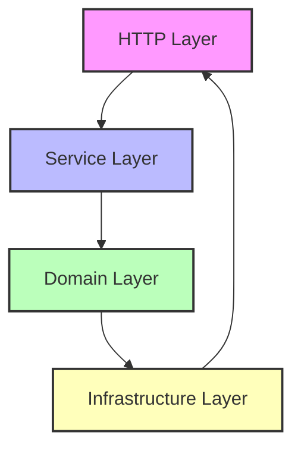

# ADR-001: Clean Architecture with Dependency Injection

**Date:** 2025-06-20  
**Status:** Accepted  
**Deciders:** Backend Development Team

## Context

The original poo-tracker backend had several architectural issues:

- Mixed concerns in handlers (business logic + HTTP logic)
- Direct repository calls from handlers (no service layer)
- Tight coupling making testing difficult
- No clear separation of domain logic
- Inconsistent error handling patterns
- Monolithic dependency wiring in main.go

We needed a maintainable, testable, and scalable architecture that follows Go best practices.

## Decision

We will implement **Clean Architecture** with the following principles:

### 1. Layer Separation



- **Domain Layer**: Pure business logic, no external dependencies
- **Service Layer**: Application logic, orchestrates domain and infrastructure
- **Infrastructure Layer**: External concerns (database, HTTP, etc.)
- **HTTP Layer**: Transport logic only

### 2. Dependency Injection

- Explicit constructor injection (no magic containers)
- All dependencies injected through interfaces
- Single responsibility principle for each service
- Easy to mock for testing

### 3. Interface-Driven Development

- Every layer depends on interfaces, not implementations
- Repository pattern for data access
- Service interfaces for business operations
- Easy to swap implementations (memory ↔ database)

### 4. Domain-Driven Design

- Each business domain in separate package
- Domain models are the source of truth
- Business rules enforced in domain/service layers
- Rich domain errors with context

## Consequences

### Positive

- **Testability**: Easy to unit test with mocked dependencies
- **Maintainability**: Clear separation of concerns
- **Flexibility**: Easy to swap implementations (in-memory ↔ PostgreSQL)
- **Scalability**: New features follow established patterns
- **Clean Code**: Each layer has single responsibility
- **Type Safety**: Interface contracts prevent runtime errors

### Negative

- **Learning Curve**: More complex than simple monolithic handlers
- **Boilerplate**: More files and interfaces to maintain
- **Over-engineering**: May be complex for simple CRUD operations

### Neutral

- **Performance**: Minimal overhead from interface indirection
- **File Count**: More files but better organization
- **Dependencies**: Clear dependency tree, easier to understand

## Implementation Details

### Repository Pattern

```go
// Domain defines the contract
type Repository interface {
    Create(ctx context.Context, user *User) error
    GetByID(ctx context.Context, id string) (*User, error)
}

// Infrastructure implements it
type memoryRepository struct { /* ... */ }
type postgresRepository struct { /* ... */ }
```

### Service Layer

```go
type UserService struct {
    repo Repository // Injected dependency
}

func (s *UserService) Register(ctx context.Context, input *RegisterInput) (*User, error) {
    // Business logic here
    // Calls repo through interface
}
```

### Dependency Injection Container

```go
type Container struct {
    UserRepository user.Repository
    UserService    user.Service
}

func NewContainer() *Container {
    repo := memory.NewUserRepository()
    service := service.NewUserService(repo)

    return &Container{
        UserRepository: repo,
        UserService:    service,
    }
}
```

## Validation

We validated this decision through:

1. **Prototype Implementation**: Built user domain with full stack
2. **Test Coverage**: Achieved >90% test coverage with mocks
3. **Performance Testing**: No significant overhead
4. **Code Review**: Clean, readable, maintainable code
5. **Developer Experience**: Easier to add new features

## Alternative Considered

### Simple Handler → Repository Pattern

**Pros:**

- Fewer files and interfaces
- Faster initial development
- Less abstraction

**Cons:**

- Business logic scattered in handlers
- Hard to test (requires database)
- Tight coupling to HTTP framework
- No clear domain modeling

**Decision:** Rejected for long-term maintainability concerns

### Framework-Heavy Approach (like Spring Boot)

**Pros:**

- Lots of built-in features
- Convention over configuration
- Automatic dependency wiring

**Cons:**

- Heavy framework dependency
- Magic behavior (hard to debug)
- Not idiomatic Go
- Less control over architecture

**Decision:** Rejected for Go's philosophy of explicit over implicit

## References

- [Clean Architecture by Robert C. Martin](https://blog.cleancoder.com/uncle-bob/2012/08/13/the-clean-architecture.html)
- [Go Project Layout](https://github.com/golang-standards/project-layout)
- [Dependency Injection in Go](https://go.dev/blog/wire)
- [Repository Pattern in Go](https://threedots.tech/post/repository-pattern-in-go/)

## Future Considerations

- Consider adding event sourcing for analytics
- Evaluate CQRS for read/write separation
- Monitor performance as data grows
- Consider GraphQL for flexible API queries
